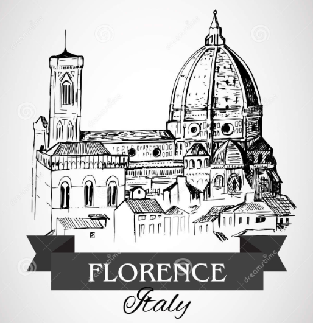
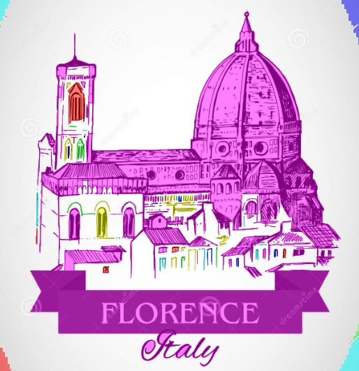

# Project: Handmade Sketch Colorization using Segmentation Techniques

# How to run the code
<!-- list -->
* Clone the repository
* Install the dependencies using `pip install -r requirements.txt`
* Run the file `main.py` using `python3 main.py` optional flags to run the file are:
  * `-i` or `--input` for input image path
  * `-c` or `--color` for color map name choices are `cool`, `spring`, `summer`, `autumn`, `winter`, `rainbow`, `ocean` (default is `cool`)
  * `-t` or `--threshold` for threshold value for segmentation (default is `150` and should be in range `0-255`)
  * `-tt` or `--thresh_type` for threshold type for segmentation choices are `BINARY`, `BINARY_INV`, `TRUNC`, `TOZERO`, `TOZERO_INV` (default is `TOZERO_INV`)
  * `-s` or `--show` if show the output image (default is `True`)
  * `-h` or `--help` for help
* Example: `python3 main.py -i data/flo.png -c cool -t 150 -s True`

# Table of Contents

<!-- list -->
* [Introduction](#introduction) 
* [Dataset](#dataset)
* [Model](#model)
* [Results](#results)
* [References](#references)
* [License](#license)
* [Contributors](#contributors)

## Introduction
This is a project about colorization of hand-drawn sketches using segmentation techniques. The project is meant to focus on pre deep learning techniques and their application in the field of image processing. The project is a part of the course Computer Vision here at IIT Jodhpur.

## Dataset
We haven't used any specific dataset for the project. Though we referred two datasets QuickDraw and Foreground/Background dataset for experimentation and testing. 

## Model
The model used here is not a machine learning model exactly and that is a class which do the colorization of the sketch using OpenCV library on the algorithmic basis. Hence our model is basically a class which takes the sketch as input and returns the colorized image as output. The class is defined in the file `sketch.py` which first do the segmentation of the given image based on some threshold value to which whole algorithm is highly sensitive and then do the colorization of the image based on the segmentation. Then we color the image based on segmented lines from the provided color map. 

## Results
The results of the model are shown below:
<!-- show two images one is the sketch and other is the colorized image side by side. -->
<table>
  <tr>
    <td></td>
    <td></td>
  </tr>
</table>

## References
* [Quick, Draw! Dataset](https://quickdraw.withgoogle.com/)
* [Foreground/ Background Dataset](https://github.com/SketchyScene/SketchySceneColorization/tree/master/Instance_Matching)
* [OpenCV](https://docs.opencv.org/4.x/d6/d00/tutorial_py_root.html)

## License
This project is licensed under the IIT Jodhpur License - see the [LICENSE.md](LICENSE.md) file for details

## Contributors
* [Tushar Kumar](https://github.com/vincit0re)